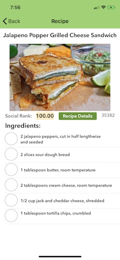
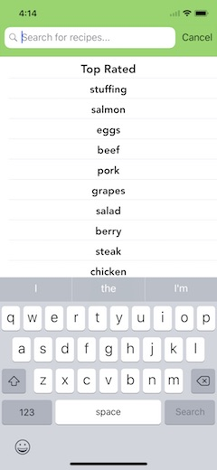
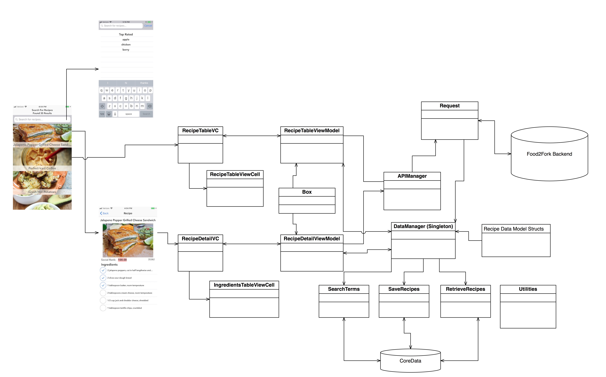

# Recipe Finder




## Overview

The purpose of this app is to help someone find a recipe.

Upon starting the app, you are presented with a table of top rated recipes in descending order.  As you scroll, the table loads more recipes.  Tapping on a recipe cell segues to the detail of the recipe.  Tapping on the search bar, allows searching for new recipes based on the search terms entered.

Key Features:
- Show top rated recipes.
- Show details of recipe including ingredients.
- Check mark next to each ingredient to check off after use when making recipe.
- Find new recipes based on search terms.
- View history of previous search terms, tap to reload.
- Check for network connection.  If no network, display message.
- Automatically stores previous search terms and shows in searchbar controller when active
- View previous recipe search results offline. Recipe details, except for ingredients, are available offline also.
- View count of total number of loaded recipes in navigation bar.  Updated as more recipes load while scrolling.
- Support for iOS 9 and above.


## Each Screen
* **Top Rated**  When you first launch, the top rated recipes are shown.  Scroll to load more.
* **Recipe Detail**  Here is the detail of the recipe.  It also loads the ingredients and adds a checkbox next to each ingredient so the user can check the ingredient after it has been used in the recipe.  The check mark does not persist. If you load the recipe again, the check marks will be empty.  Perhaps persistence could be added.
* **Search Terms**  Tap on the search bar to enter a new search term. Or select from a previous search  by tapping on the search term. The search terms are sorted for the most recent search first.   

## Architecture
This app uses the MVVM design pattern.  There is a separate view model for each view controller.

A bind and box approach is used for view controllers to monitor view model properties for changes. With this approach, the view controllers can observe changes to the data (binding to the data) and then update the views. The Bind class is a wrapper that uses generics to be compatible with any type. This binding mechanism allows things like text fields to update when the data changes.

The Services classes separate out the different networking tasks: The API calls, the actual request, and the decoding of the JSON to local struct data model.

The app is written in Swift 4.

CoreData is used to store the search terms. The Disk framework is used to store recipe searches for retrieval when the device is offline.  More work is needed to support offline viewing of individual recipes.

Overall Design


....more to come

## Offline
If no cellular or WiFi is detected, no results will be shown on launch but a message will appear asking the user to tap in the search bar to get a list of previous searches.  Then by tapping on any of those search terms, a list of 30 recipes from that search term will appear.  It is limited to 30 right now.  Tap the search bar again and load one of the other search terms and those 30 recipes will all appear offline.  Images are stored offline as well using Kingfisher. Individual receipe details that have been viewed from search terms are available offline.  If a individual recipe from a search term was not viewed when the device was online, then only the image, recipe social rank and recipe id will display (e.g. no ingredients). Top rated recipes (the ones shown at launch) are not available offline.

## Use Of CoreData
The search terms are store and retrieved in CoreData.  Support is there for CoreData in iOS9 and above.  Apple changed how CoreData works in iOS 10 (maybe iOS 9.1?).  The offline list of 30 recipes is stored using the Disk framework into the local cache storage.  With further work, perhaps this could be stored in CoreData.  Right now, the CoreData stack code is in the AppDelegate but probably should be moved out into a separate class. Migrations are not supported at this time.

## Requriements for Building and Using

* You need iOS 9 or above.  
* The pods are checked into to the master repo.  This is because of a pending bug in the M13Checkbox Pod.  So do not run:  Pod Install.
* You need a API Key from Food2Fork.com.  Implement a globally accessible struct similar to this:
```
  struct APIKeyService {
    static let API_KEY = "your api key"
  }
```

## Installation of Pods
### Included Libraries via Pods
1. M13Checkbox - for a check mark in next to ingredients in DeailView. https://github.com/Marxon13/M13Checkbox
2. Kingfisher - for image downloading, caching and management. https://github.com/onevcat/Kingfisher
3. Reachability by Ashley Mills - to handle checking for a network connection and if not there redirecting the user to Settings. https://github.com/ashleymills/Reachability.swift
4. SwiftSpinner - A very nice spinner.  I use it here for to let the user know the data is still loading.  A much nicer approach than the activity indicator in iOS. https://github.com/icanzilb/SwiftSpinner
5. Disk - A framework to persist structs, images and data.  https://github.com/saoudrizwan/Disk

No need to run the Podfile as the pods are checkin.  As of November 12, the M13Checkbox pod has a bug in the M13Checkbox.swift file.  Without changing a line of code, you will only see one check box needs to one of the list of ingredients.  The fix is in the checked in Pod.  The fix is to change line 218 in the M13Checkbox.swift file like this:
```
//fileprivate var controller: M13CheckboxController = DefaultValues.controller
fileprivate var controller: M13CheckboxController = M13CheckboxStrokeController()
```


## Implementation Highlights:

* Swift 4 Decodable Protocol for parsing JSON from the server.
* Networking with URLSession broken down into single responsibility classes.
* Singleton for the data model. Simple struct data model.
* Using Storyboard
* Lazy loading of data source object using prefetch rows so data is ready as user scrolling approaches those cells.
* Caching of images for better performance.  Loading of a default image while network requests underway.
* Separate utilities for colors, constants and reachability.
* Cell configuration in cell class not view controller.
* MVVM architecture for shrinking size of ViewControllers and separating data management from the view controllers into the views.
* ...

---

Additional Work To Do
* Add more unit and UI tests - a few included now.
* Continue working on documentation
* Improve offline. Perhaps store more than 30
* Delete search terms from table view
* Further testing
* Add offline support for top rated recipes views at app launch
* Testing on iOS 9 and iOS 10
* CoreData testing on iOS 9
* Separate the CoreData stack from the AppDelegate
* Test and adjust for iPad, landscape and different screen sizes. Development was done primarily on a iPhone 7 Plus device and simulator and a iPhone 6 device. All other variants need testing.
* Look for refactoring and code clean up opportunities
* Additional inline code documentation
* More work on error handling
* Better logging of debug and error messages
* Checks for odd search strings for searching and file saving
* Fix warnings in debugger regarding layout constrain issues
* Fix issues with loading recipe detail
* Review offline storage limits and add checks for hitting limits
* ...


Copyright Dave Rothschild November 2017. Not for commercial use.
